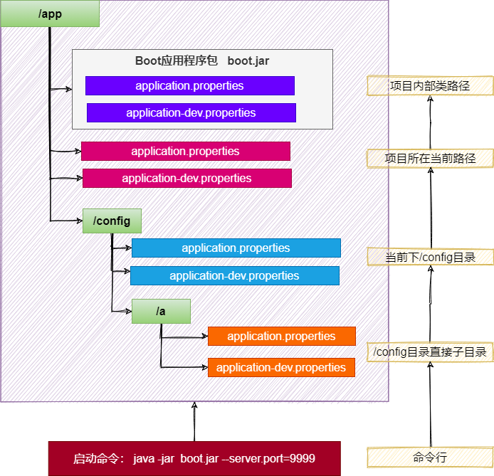

# 基础特性

## 自定义banner

1. 类路径添加banner.txt或设置spring.banner.location就可以定制 banner
2. 推荐网站：https://www.bootschool.net/ascii

## 自定义SpringApplication

```java
import org.springframework.boot.Banner;
import org.springframework.boot.SpringApplication;
import org.springframework.boot.autoconfigure.SpringBootApplication;

@SpringBootApplication
public class MyApplication {

    public static void main(String[] args) {
        SpringApplication application = new SpringApplication(MyApplication.class);
        application.setBannerMode(Banner.Mode.OFF);
        application.run(args);
    }

}
```

## FluentBuilder Api

```java
new SpringApplicationBuilder()
        .sources(Parent.class)
        .child(Application.class)
        .bannerMode(Banner.Mode.OFF)
        .run(args);
```

# Profiles

> 环境隔离能力；快速切换开发、测试、生产环境
> 步骤：
> 1. 标识环境：指定哪些组件、配置在哪个环境生效
> 2. 切换环境：这个环境对应的所有组件和配置就应该生效
>

## 使用

### 指定环境

> Spring Profiles 提供一种隔离配置的方式，使其仅在特定环境生效；
> 任何@Component, @Configuration 或 @ConfigurationProperties 可以使用 @Profile 标记，来指定何时被加载。【容器中的组件都可以被
> @Profile标记】

### 环境激活

1. 配置文件

```properties
spring.profiles.active=production,hsqldb
```

2. 命令行 。--spring.profiles.active=dev,hsqldb
3. 默认环境 spring.profiles.default=test
4. 推荐使用激活方式指定环境

### 环境包含

1. spring.profiles.active 和spring.profiles.default 只能用到 无 profile 的文件中，如果在application-dev.yaml中编写就是无效的
2. 也可以额外添加生效文件，而不是激活替换。比如：

```properties
spring.profiles.include[0]=common
spring.profiles.include[1]=local
```

### 最佳实战：

- 生效的环境 = 激活的环境/默认环境 + 包含的环境
- 项目里面这么用
- 基础的配置mybatis、log、xxx：写到包含环境中
- 需要动态切换变化的 db、redis：写到激活的环境中

## 分组

```properties
spring.profiles.group.prod[0]=db
spring.profiles.group.prod[1]=mq
```

## 配置文件

- application-{profile}.properties可以作为指定环境的配置文件。
- 激活这个环境，配置就会生效。最终生效的所有配置是
    - application.properties：主配置文件，任意时候都生效
    - application-{profile}.properties：指定环境配置文件，激活指定环境生效
- profile优先级 > application

# 外部化配置

> 场景：线上应用如何快速修改配置，并应用最新配置？
> - SpringBoot 使用 配置优先级 + 外部配置 简化配置更新、简化运维。
> - 只需要给jar应用所在的文件夹放一个application.properties最新配置文件，重启项目就能自动应用最新配置

## 配置优先级

Spring Boot 允许将配置外部化，以便可以在不同的环境中使用相同的应用程序代码。
我们可以使用各种外部配置源，包括Java Properties文件、YAML文件、环境变量和命令行参数。
@Value可以获取值，也可以用@ConfigurationProperties将所有属性绑定到java object中
以下是 SpringBoot 属性源加载顺序。后面的会覆盖前面的值。由低到高，高优先级配置覆盖低优先级

1. 默认属性（通过SpringApplication.setDefaultProperties指定的）
2. @PropertySource指定加载的配置（需要写在@Configuration类上才可生效）
3. 配置文件（application.properties/yml等）
4. RandomValuePropertySource支持的random.*配置（如：@Value("${random.int}")）
5. OS 环境变量
6. Java 系统属性（System.getProperties()）
7. JNDI 属性（来自java:comp/env）
8. ServletContext 初始化参数
9. ServletConfig 初始化参数
10. SPRING_APPLICATION_JSON属性（内置在环境变量或系统属性中的 JSON）
11. 命令行参数
12. 测试属性。(@SpringBootTest进行测试时指定的属性)
13. 测试类@TestPropertySource注解
14. Devtools 设置的全局属性。($HOME/.config/spring-boot)
15.

> 结论：配置可以写到很多位置，常见的优先级顺序：
> 命令行> 配置文件> springapplication配置


配置文件优先级如下：(后面覆盖前面)

1. jar 包内的application.properties/yml
2. jar 包内的application-{profile}.properties/yml
3. jar 包外的application.properties/yml
4. jar 包外的application-{profile}.properties/yml

建议：用一种格式的配置文件。如果.properties和.yml同时存在,则.properties优先
> 结论：包外 > 包内； 同级情况：profile配置 > application配置


所有参数均可由命令行传入，使用--参数项=参数值，将会被添加到环境变量中，并优先于配置文件。
比如java -jar app.jar --name="Spring",可以使用@Value("${name}")获取

## 外部配置

SpringBoot 应用启动时会自动寻找application.properties和application.yaml位置，进行加载。顺序如下：（后面覆盖前面）

1. 类路径: 内部
   a. 类根路径
   b. 类下/config包
2. 当前路径（项目所在的位置）
   a. 当前路径
   b. 当前下/config子目录
   c. /config目录的直接子目录

最终效果：优先级由高到低，前面覆盖后面

- 命令行 > 包外config直接子目录 > 包外config目录 > 包外根目录 > 包内目录
- 同级比较：
- profile配置 > 默认配置
- properties配置 > yaml配置



规律：最外层的最优先。

- 命令行 > 所有
- 包外 > 包内
- config目录 > 根目录
- profile > application
  配置不同就都生效（互补），配置相同高优先级覆盖低优先级

## 导入配置

使用spring.config.import可以导入额外配置

```properties
spring.config.import=my.properties
my.property=value
```

无论以上写法的先后顺序，my.properties的值总是优先于直接在文件中编写的my.property。

## 属性占位符

配置文件中可以使用 ${name:default}形式取出之前配置过的值。

```properties
app.name=MyApp
app.description=${app.name} is a Spring Boot application written by ${username:Unknown}
```

# 单元测试

## 整合

SpringBoot 提供一系列测试工具集及注解方便我们进行测试。
spring-boot-test提供核心测试能力，spring-boot-test-autoconfigure 提供测试的一些自动配置。
我们只需要导入spring-boot-starter-test 即可整合测试

spring-boot-starter-test 默认提供了以下库供我们测试使用

- JUnit 5
- Spring Test
- AssertJ
- Hamcrest
- Mockito
- JSONassert
- JsonPath

## 测试

### 组件测试

直接@Autowired容器中的组件进行测试

### 注解

JUnit5的注解与JUnit4的注解有所变化
https://junit.org/junit5/docs/current/user-guide/#writing-tests-annotations

- @Test :表示方法是测试方法。但是与JUnit4的@Test不同，他的职责非常单一不能声明任何属性，拓展的测试将会由Jupiter提供额外测试
- @ParameterizedTest :表示方法是参数化测试，下方会有详细介绍
- @RepeatedTest :表示方法可重复执行，下方会有详细介绍
- @DisplayName :为测试类或者测试方法设置展示名称
- @BeforeEach :表示在每个单元测试之前执行
- @AfterEach :表示在每个单元测试之后执行
- @BeforeAll :表示在所有单元测试之前执行
- @AfterAll :表示在所有单元测试之后执行
- @Tag :表示单元测试类别，类似于JUnit4中的@Categories
- @Disabled :表示测试类或测试方法不执行，类似于JUnit4中的@Ignore
- @Timeout :表示测试方法运行如果超过了指定时间将会返回错误
- @ExtendWith :为测试类或测试方法提供扩展类引用

### 断言

| 方法                | 说明                 |
|-------------------|--------------------|
| assertEquals      | 判断两个对象或两个原始类型是否相等  |
| assertNotEquals   | 判断两个对象或两个原始类型是否不相等 |
| assertSame        | 判断两个对象引用是否指向同一个对象  |
| assertNotSame     | 判断两个对象引用是否指向不同的对象  |
| assertTrue        | 判断给定的布尔值是否为 true   |
| assertFalse       | 判断给定的布尔值是否为 false  |
| assertNull        | 判断给定的对象引用是否为null   |
| assertNotNull     | 判断给定的对象引用是否不为 null |
| assertArrayEquals | 数组断言               |
| assertAll         | 组合断言               |
| assertThrows      | 异常断言               |
| assertTimeout     | 超时断言               |
| fail              | 快速失败               |
### 嵌套测试
> JUnit 5 可以通过 Java 中的内部类和@Nested 注解实现嵌套测试，从而可以更好的把相关的测试方法组织在一起。在内部类中可以使用@BeforeEach 和@AfterEach 注解，而且嵌套的层次没有限制。
> 

```java
@DisplayName("A stack")
class TestingAStackDemo {

    Stack<Object> stack;

    @Test
    @DisplayName("is instantiated with new Stack()")
    void isInstantiatedWithNew() {
        new Stack<>();
    }

    @Nested
    @DisplayName("when new")
    class WhenNew {

        @BeforeEach
        void createNewStack() {
            stack = new Stack<>();
        }

        @Test
        @DisplayName("is empty")
        void isEmpty() {
            assertTrue(stack.isEmpty());
        }

        @Test
        @DisplayName("throws EmptyStackException when popped")
        void throwsExceptionWhenPopped() {
            assertThrows(EmptyStackException.class, stack::pop);
        }

        @Test
        @DisplayName("throws EmptyStackException when peeked")
        void throwsExceptionWhenPeeked() {
            assertThrows(EmptyStackException.class, stack::peek);
        }

        @Nested
        @DisplayName("after pushing an element")
        class AfterPushing {

            String anElement = "an element";

            @BeforeEach
            void pushAnElement() {
                stack.push(anElement);
            }

            @Test
            @DisplayName("it is no longer empty")
            void isNotEmpty() {
                assertFalse(stack.isEmpty());
            }

            @Test
            @DisplayName("returns the element when popped and is empty")
            void returnElementWhenPopped() {
                assertEquals(anElement, stack.pop());
                assertTrue(stack.isEmpty());
            }

            @Test
            @DisplayName("returns the element when peeked but remains not empty")
            void returnElementWhenPeeked() {
                assertEquals(anElement, stack.peek());
                assertFalse(stack.isEmpty());
            }
        }
    }
}
```

### 参数化测试

参数化测试是JUnit5很重要的一个新特性，它使得用不同的参数多次运行测试成为了可能，也为我们的单元测试带来许多便利。

利用@ValueSource等注解，指定入参，我们将可以使用不同的参数进行多次单元测试，而不需要每新增一个参数就新增一个单元测试，省去了很多冗余代码。

@ValueSource: 为参数化测试指定入参来源，支持八大基础类以及String类型,Class类型
@NullSource: 表示为参数化测试提供一个null的入参
@EnumSource: 表示为参数化测试提供一个枚举入参
@CsvFileSource：表示读取指定CSV文件内容作为参数化测试入参
@MethodSource：表示读取指定方法的返回值作为参数化测试入参(注意方法返回需要是一个流)

```java
@ParameterizedTest
@ValueSource(strings = {"one", "two", "three"})
@DisplayName("参数化测试1")
public void parameterizedTest1(String string) {
    System.out.println(string);
    Assertions.assertTrue(StringUtils.isNotBlank(string));
}


@ParameterizedTest
@MethodSource("method")    //指定方法名
@DisplayName("方法来源参数")
public void testWithExplicitLocalMethodSource(String name) {
    System.out.println(name);
    Assertions.assertNotNull(name);
}

static Stream<String> method() {
    return Stream.of("apple", "banana");
}
```